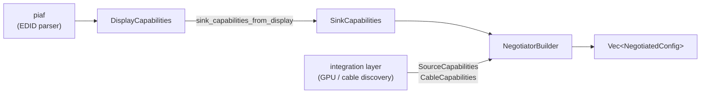

# concordance

[](https://github.com/DracoWhitefire/concordance/actions/workflows/ci.yml)
[](https://crates.io/crates/concordance)
[](https://docs.rs/concordance)
[](https://github.com/DracoWhitefire/concordance/blob/main/LICENSE)
[](https://blog.rust-lang.org/2025/02/20/Rust-1.85.0.html)
[](https://slsa.dev)

HDMI 2.1 mode negotiation — policy layer of the display connection stack.

Given sink, source, and cable capabilities, concordance answers: "what modes can I drive
on this display, in what priority order, using what color format and bit depth?"

The library takes three caller-supplied structs — `SinkCapabilities`, `SourceCapabilities`,
and `CableCapabilities` — and runs them through a three-stage pipeline: enumerate all
candidate configurations, check each against HDMI specification constraints, rank the
accepted candidates according to a policy. The output is a ranked `Vec<NegotiatedConfig>`,
each entry carrying the resolved mode, color format, FRL tier, and any non-fatal warnings.
A `ReasoningTrace` on each entry records why a configuration was accepted or rejected, so
every output is fully explainable.

For embedded and firmware targets, the constraint engine is also exposed as a standalone
`no_std`-compatible probe:

```rust
use concordance::{is_config_viable, SinkCapabilities, SourceCapabilities, CableCapabilities, CandidateConfig};
use display_types::{ColorBitDepth, ColorFormat};
use display_types::cea861::{HdmiForumFrl, vic_to_mode};

// For standard CTA modes, use vic_to_mode — it carries the exact pixel clock from
// the CEA-861 timing table, so bandwidth ceiling checks are precise.
// VIC 97 = 3840×2160 @ 60 Hz (594 MHz). Other common VICs: 16 = 1080p@60, 97 = 4K@60.
let mode = vic_to_mode(97).unwrap();
let config = CandidateConfig::new(
    &mode,
    ColorFormat::Rgb444,
    ColorBitDepth::Depth8,
    HdmiForumFrl::NotSupported,
    false,
);

match is_config_viable(&sink, &source, &cable, &config) {
    Ok(_warnings) => println!("viable"),
    Err(violations) => {
        // Each violation is a TaggedViolation<Violation>: Display shows "[rule] message".
        for v in &violations { eprintln!("rejected: {v}"); }
    }
}
```

For the full ranked pipeline (`alloc`/`std`):

```rust
use concordance::NegotiatorBuilder;

let configs = NegotiatorBuilder::default()
    .negotiate(&sink, &source, &cable);

for cfg in &configs {
    println!("{}×{}@{} {:?} {:?}",
        cfg.resolved.mode.width, cfg.resolved.mode.height, cfg.resolved.mode.refresh_rate,
        cfg.resolved.color_encoding, cfg.resolved.bit_depth);
}
```

Custom constraint rules can be injected without replacing the default engine:

```rust
use concordance::NegotiatorBuilder;

let configs = NegotiatorBuilder::default()
    .with_extra_rule(PlatformBandwidthRule::new(limits))
    .negotiate(&sink, &source, &cable);
```

## Why concordance

**Ranked iterator, not a verdict.** There is no single right answer. The library enumerates
all valid configurations in a defined, documented priority order and lets the caller pick.
No mode is silently discarded — rejections appear in the reasoning trace.

**Every output is explainable.** Each `NegotiatedConfig` carries a `ReasoningTrace`
recording the decisions made during negotiation. A driver or diagnostic tool can explain
exactly why a given mode was selected or excluded.

**Extensible without forking.** The three pipeline components — `ConstraintEngine`,
`CandidateEnumerator`, `ConfigRanker` — are traits with default implementations. Any
component can be replaced or wrapped via `NegotiatorBuilder` without touching crate source.
For the common case of adding a rule on top of the default checks, `with_extra_rule` injects
a single `ConstraintRule` without reimplementing everything else.

**Custom violation and warning types.** `ConstraintEngine` and `ConfigRanker` declare
associated `Warning` and `Violation` types bounded by `Diagnostic`. A custom component emits
its own variants with full type fidelity — no wrapping, no loss of structured information.

**Cable is a first-class constraint.** Link capability is determined by source, sink, *and*
cable. A cable that cannot carry FRL or whose TMDS clock ceiling is too low produces a
`Violation` like any other constraint failure. `CableCapabilities::unconstrained()` is
provided for callers without cable information.

**`no_std` at all resource levels.** Three build tiers are explicitly supported:
- Bare `no_std` (no allocator): `is_config_viable` borrows all inputs, no heap use.
- `no_std + alloc`: the ranked pipeline and `ReasoningTrace` are available.
- `std`: full feature set, additive on top of `alloc`.

**Serde on all public types.** Every public type derives `Serialize`/`Deserialize` behind
the `serde` feature flag, covering inputs, outputs, and policy types.

## Feature flags

| Flag    | Default | Description                                              |
|---------|---------|----------------------------------------------------------|
| `std`   | yes     | Enables the ranked pipeline and `ReasoningTrace`; implies `alloc` |
| `alloc` | no      | Enables the ranked pipeline without `std`                |
| `serde` | no      | Derives `Serialize`/`Deserialize` on all public types    |

Without `alloc` or `std`, only `is_config_viable` is available. The three input structs and
`CandidateConfig` are available at all tiers.

## Stack position

concordance is the policy layer. It consumes the typed model; it does not produce it.



All types in `SinkCapabilities` — `VideoMode`, `HdmiForumSinkCap`, `HdmiVsdb`,
`ColorCapabilities`, etc. — are from
[`display-types`](https://crates.io/crates/display-types), the shared vocabulary crate.
`sink_capabilities_from_display` in concordance bridges a parsed `DisplayCapabilities`
directly into `SinkCapabilities`; the integration layer only needs to supply source and
cable capabilities.

## Out of scope

- **EDID parsing** — that's [piaf](https://github.com/DracoWhitefire/piaf).
- **Source capability discovery** — querying DRM/KMS or VBIOS for GPU limits.
- **Cable capability discovery** — reading the HDMI cable type marker or accepting a
  user override.
- **Link training** — determining whether a negotiated FRL tier is achievable on real hardware.
- **InfoFrame encoding** — signaling the negotiated configuration to the sink.
- **HDCP** — out of scope for the entire stack.

## Documentation

Extended documentation lives under [`doc/`](doc/).

**Understanding the library**

- [`doc/architecture.md`](doc/architecture.md) — pipeline structure, constraint rules, ranking algorithm, and design principles
- [`doc/enumerator.md`](doc/enumerator.md) — candidate enumeration, Cartesian product dimensions, and pre-filtering

**Contributing**

- [`doc/setup.md`](doc/setup.md) — build, test, and coverage commands
- [`doc/testing.md`](doc/testing.md) — testing strategy, fixture corpus, and CI expectations
- [`doc/roadmap.md`](doc/roadmap.md) — planned features and future work

## Verifying releases

Each release is built on GitHub Actions and attested with
[SLSA Build Level 2](https://slsa.dev) provenance. To verify a release
`.crate` against its signed provenance, install the
[GitHub CLI](https://cli.github.com/) and run:

```sh
gh attestation verify concordance-X.Y.Z.crate --repo DracoWhitefire/concordance
```

The attested `.crate` is attached to each
[GitHub release](https://github.com/DracoWhitefire/concordance/releases).

## License

Licensed under the [Mozilla Public License 2.0](https://github.com/DracoWhitefire/concordance/blob/main/LICENSE).
